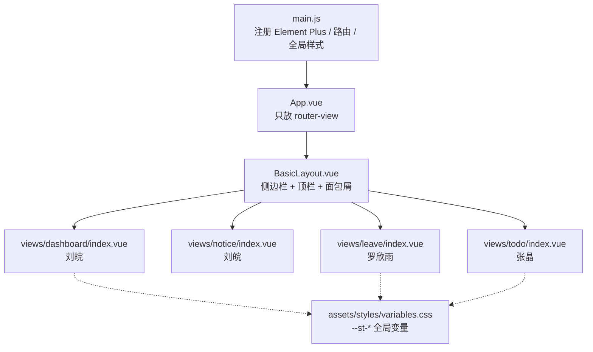

# 项目框架说明

> 写给刘皖（技术规范 + 仓库管理）。
> 这份文档回答一个问题：**三个人同时在改一个仓库，凭什么不会互相打架？**

---

## 一、一句话架构

```
浏览器输入 /leave
   ↓  Vue Router 按路由表匹配
   ↓  BasicLayout 渲染外壳（侧边栏 + 顶栏 + 面包屑）
   ↓  <router-view> 塞进 views/leave/index.vue
   ↓  页面里的数据先用本地假数据（mock）
```

**两个决定性的设计：**

1. **`BasicLayout` 只写一次。** 侧边栏、顶栏、面包屑、菜单高亮全部在这里，队友的页面只管「内容区」，不需要碰导航。所以队友改页面永远不会改坏别人的导航栏。
2. **路由表集中在一个文件。** `src/router/index.js` 由你独占维护，队友不碰。这是全组唯一会「被三个人同时改」的文件，把它锁死，冲突就少了最大的一块。

---

## 二、目录职责表

| 目录 / 文件 | 谁负责 | 其他人能不能改 |
| --- | --- | --- |
| `src/main.js` | 刘皖 | ❌ 不能 |
| `src/router/index.js` | 刘皖 | ❌ 不能 |
| `src/layout/BasicLayout.vue` | 刘皖 | ❌ 不能 |
| `src/assets/styles/variables.css` | 刘皖 | ⚠️ 只能提需求，不能自己加 |
| `src/views/dashboard/` | 刘皖 | ❌ 不能 |
| `src/views/notice/` | 刘皖 | ❌ 不能 |
| `src/views/leave/` | 罗欣雨 | ✅ 只有她能改 |
| `src/views/todo/` | 张晶 | ✅ 只有她能改 |
| `vite.config.js` / `package.json` | 刘皖 | ❌ 不能 |

**核心规则：一个人 = 一个文件夹 = 一行路由。**
文件夹是私有的，路由行是共有的但由你代填。

---

## 三、分层结构



**样式是自上而下单向覆盖的：**

```
element-plus/dist/index.css   ← 组件库默认样式
        ↓ 被覆盖
variables.css                 ← 你的 --st-* 变量
        ↓ 被覆盖
页面自己的 <style scoped>      ← 只影响自己那个页面
```

所以 `main.js` 里这两个 import 的顺序不能调换：

```js
import 'element-plus/dist/index.css' // 必须在前
import '@/assets/styles/variables.css' // 必须在后
```

---

## 四、数据流（现在 → 将来）

| 阶段 | 数据从哪来 | 要改哪里 |
| --- | --- | --- |
| **现在** | 页面里写死的假数据（`ref([])`） | 无 |
| **接后端后** | `axios` 请求接口 | 只改页面里取数据的那几行，模板和样式不动 |

每个页面的假数据都写在 `<script setup>` 顶部并标了注释，就是为了一眼能找到替换点。

将来接后端时（现在不用管）的接法：

```js
// 新建 src/api/leave.js
export const getLeaveList = (params) => request.get('/leave', { params })

// 页面里把  const list = ref([...])  换成
const list = ref(await getLeaveList())
```

---

## 五、三条铁律（防止冲突）

1. **不碰别人的文件夹。** 需要改别人的页面，先在群里说，让对方改。
2. **不碰 `router/index.js`。** 你的路由行已经配好了，不需要动。真要加页面，找刘皖加。
3. **颜色只用变量。** 想用一个变量表里没有的颜色，找刘皖加到 `variables.css`，不要自己写 `#xxxxxx`。

---

## 六、你（刘皖）要守住的事

- ✅ `main` 分支永远能跑起来。每次合并 PR 前先 `npm run build`，报错就打回去。
- ✅ 队友的 PR 只允许改动「她自己那个文件夹」。如果 PR 里出现了 `router/index.js`、`main.js`、别人的页面 → 打回去重做。
- ✅ 合并前检查页面上「工作台 → 公告 → 请假 → 待办」四个菜单能不能互相跳转、返回会不会白屏。
- ✅ 队友说「我要加一个新页面」时，由你改 `router/index.js` + 给菜单加一行，不要让她自己加。

---

## 七、当前进度快照

| 模块 | 状态 | 位置 |
| --- | --- | --- |
| 项目初始化 / 依赖 | ✅ 完成 | `package.json` |
| 整体布局 + 路由 | ✅ 完成 | `layout/`、`router/` |
| 全局样式变量 + 代码规范 | ✅ 完成 | `assets/styles/`、`.prettierrc.json` |
| 工作台首页 | ✅ 完成 | `views/dashboard/` |
| 公告通知页 | ✅ 完成 | `views/notice/` |
| 请假申请页 | ⬜ 占位 | `views/leave/` |
| 待办事项页 | ⬜ 占位 | `views/todo/` |
| 后端接口 | ⬜ 未开始 | — |
